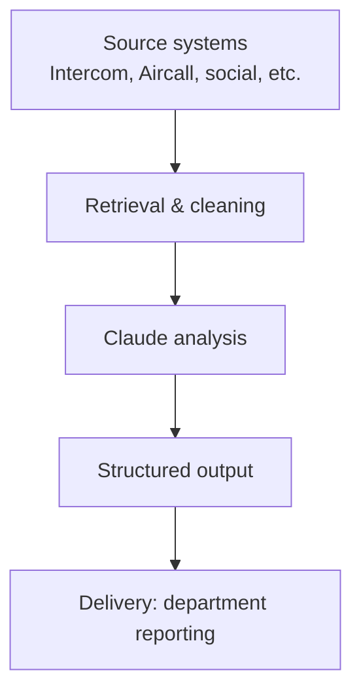

# Voice of Customer (VoC)

## Table of Contents
- [Executive Summary](#executive-summary)
- [Problem Statement](#problem-statement)
- [Solution & Architecture](#solution--architecture)
- [Data Sources](#data-sources)
- [Department Status](#department-status)
  - [VIP](#vip)
  - [Customer Support](#customer-support)
  - [Marketing](#marketing)
- [Technical Implementation](#technical-implementation)
  - [VIP](#vip-1)
  - [Customer Support](#customer-support-1)
  - [Marketing](#marketing-1)
- [Decision Log](#decision-log)
- [Current Blockers](#current-blockers)
- [Roadmap](#roadmap)

---

## Executive Summary

Voice of Customer (VoC) is a company-wide initiative to automate the capture and analysis of customer sentiment, replacing manual, ad hoc reporting processes across VIP, Customer Support, and Marketing. The initiative addresses a shared problem: each department currently relies on fragmented, partial views of customer sentiment, whether through manually logged notes, siloed support tools, or manually screened social media posts, rather than a consistent, evidence-based understanding of how customers actually feel.

The proposed solution is a pipeline that ingests verbatim customer interaction data directly from source systems and processes it through Claude to produce structured outputs: sentiment, issue category, churn risk, and key phrases. The analysis layer is designed independently of any single data source, allowing each department's pipeline to evolve on its own timeline without requiring a shared architecture to be fully complete before any one department can benefit.

As of this writing, VIP has completed initial data retrieval and cleaning from Intercom, with remaining channels still under technical investigation. Customer Support has a working pipeline built on the same approach, currently blocked on Claude API access. Marketing faces a fundamentally different constraint: customer interactions live primarily on Facebook, where automated data access is not currently being pursued (see Decision Log). In the interim, a lightweight internal tool has been built to begin structuring what is currently a fully manual process.

---

## Problem Statement

Customer interactions are scattered across multiple channels, chat platforms, phone calls, and social media, and in most cases the substance of these interactions is only preserved through manual effort: agents summarizing conversations after the fact, or administrators manually reviewing and categorizing social media posts.

This creates two related problems. First, nuance is lost: paraphrased notes and manually compiled summaries cannot fully capture the customer's own language, tone, or specific concerns, which limits the organization's ability to detect emerging issues or at-risk customers early. Second, the manual effort required to produce even these partial views represents a recurring operational cost across departments, time that could be spent on higher-value work if sentiment capture and initial categorization were automated.

VoC is designed to address both problems simultaneously: by capturing verbatim customer language directly from source systems and processing it automatically, the initiative aims to produce a more accurate, scalable understanding of customer sentiment while reducing the manual burden currently required to produce a much narrower view of the same information.

---

## Solution & Architecture

At the core of the solution is a pipeline built around a single design principle: the system responsible for analyzing customer language remains independent of its originating source. This means each department's data source, whether Intercom, Aircall, or eventually a social media platform, feeds into the same underlying analysis logic, allowing new sources to be integrated without requiring existing components to be rebuilt.

The pipeline consists of four stages:

1. **Retrieval and cleaning** — raw conversation data is pulled directly from source systems, then filtered to remove non-substantive content (automated bot responses, internal notes) so that only genuine customer language remains.
2. **Claude analysis** — cleaned data is passed to Claude, which applies a consistent set of instructions to extract sentiment, categorize the issue, assess churn risk, and surface notable phrases in the customer's own words.
3. **Structured output** — analysis results are returned in a consistent format, ensuring every interaction is evaluated against the same criteria regardless of source or department.
4. **Delivery** — structured output feeds into reporting suited to each department's specific needs.

A working prototype of the reporting output, built using representative sample data across all three departments, is available here: **[VoC mock dashboard](https://bellacmtm.github.io/VoC/voc_demo.html)**

---

## Data Sources

| Source | Department(s) | Status | Notes |
|---|---|---|---|
| Intercom | VIP, Customer Support | Active, validated | Verbatim conversation data confirmed retrievable |
| Aircall (calls) | VIP | Pending | Requires AI Assist add-on confirmation |
| Aircall (SMS/MMS) | VIP | Ruled out | No retrieval capability via API or dashboard |
| Terragon | VIP | Ruled out (long-term) | No usable API; used only for early proxy data |
| WhatsApp | VIP | Undetermined | Raw data location not yet identified |
| Telegram | VIP | Undetermined | Raw data location not yet identified |
| Facebook (pages, DMs, groups) | Marketing | Active (manual) | Data collected today via manual review; automated/API access not being pursued |
| Instagram | Marketing | Unconfirmed | Not currently part of the manual review process |

This table reflects current status only; the reasoning behind each entry, including approaches that were tested and ruled out, is documented in the Decision Log below.

---

## Department Status

### VIP

Data retrieval and cleaning from Intercom is complete, representing the first fully validated data source for this department. Conversations are pulled directly from Intercom, filtered to remove non-substantive content, and are ready to be passed into the analysis stage once Claude API access is finalized.

Coverage beyond Intercom remains undetermined. VIP interactions also occur across additional channels, including phone calls and other messaging platforms, and the technical feasibility of retrieving verbatim data from each is still being assessed individually. Findings to date on specific channels, including sources that have been ruled out, are documented in the Decision Log section below.

**Status:** Phase 1 (Intercom) complete. Additional channel coverage under investigation.

### Customer Support

Customer Support's primary interaction channel is Intercom. Following the same architecture established for other departments, data retrieval and cleaning from this channel is complete, and the pipeline is prepared to pass cleaned conversation data into the analysis stage.

The remaining step is access to the Claude API, which is currently pending approval. Once granted, this department's pipeline is expected to move to structured output and reporting with minimal additional work, as no further data source investigation is required at this stage.

**Status:** Pipeline built and ready. Blocked on Claude API access approval.

### Marketing

Marketing's customer interactions occur primarily on social media, with Facebook representing the largest volume across pages, direct messages, and private groups. Automated retrieval from these platforms is not currently pursued (see Decision Log); the data is instead collected manually.

In the current state, this process is entirely manual: administrators monitor posts directly, respond to negative feedback by directing customers to appropriate support channels, and compile a weekly digest of screenshots, manually sorted into categories, for leadership review.

As an interim measure, a lightweight internal tool has been developed to allow administrators to upload these screenshots into a structured database as they are collected, rather than compiling them manually at the end of each week. This tool is built and ready, but, like the other departments, is currently blocked on Claude API access; once access is granted, it is expected to substantially reduce the manual reporting burden described above while simultaneously building a structured dataset for sentiment analysis.

**Status:** No automated pipeline. Manual process in place, supported by an interim data collection tool currently blocked on Claude API access.

---

## Technical Implementation

### VIP

Retrieved Intercom conversation data is filtered before being passed to analysis. Two categories of non-substantive content are removed: automated bot and menu interactions, and internal agent notes that are not part of the customer-facing exchange. Internal notes are identified using Intercom's `part_type` field, which distinguishes them from actual conversation content.

[VIP data pipeline](https://github.com/bellacmtm/VoC/blob/main/VIP_convosample_intercom.py)

### Customer Support

During the data retrieval phase, certain conversation subjects are excluded, as they fall outside the scope of sentiment and VoC analysis. This exclusion list was provided by the Head of Customer Support:

- 3rd party contact
- Account reopening
- Bonus Bot Circumvention
- Bonus Bot FS
- CC - Removal
- Change of details
- Deposit Missing - Within Timeframe
- Deposit Pending - Within Timeframe
- FS - Granted
- FS - welcome offer
- No response
- SE Email Error Query
- SE Email Error Re-open
- Self Exclusion
- Take a break
- Testing
- WD - Within Timeframe
- Welcome offer - Granted

[CS data pipeline](https://github.com/bellacmtm/VoC/blob/main/CS_convosample_intercom.py)

### Marketing

The HTML intake tool used to collect and structure screenshot-based feedback from social media is here: [Data Collection Tool MK](https://github.com/bellacmtm/VoC/blob/main/MK_voc_intake.html). The tool is functional but not yet in use, pending Claude API access (see Department Status above).

---

## Decision Log

| Decision | Outcome | Reasoning |
|---|---|---|
| Use BI-exported Terragon notes as long-term data source | **Rejected** | No usable API for structured export; notes are agent-written summaries, not verbatim customer language |
| Retrieve SMS/MMS data via Aircall | **Rejected** | No retrieval endpoint exists via API or dashboard; no player ID attached to records |
| Retrieve call data via Aircall | **Pending** | Technically possible via transcription endpoint, but requires the paid AI Assist add-on; confirmation with IT in progress |
| Assume each brand requires separate Intercom access | **Under review** | Data from an unconfigured brand appeared during testing, suggesting brands may share one workspace; not yet confirmed |
| Pursue Meta Business/Developer API access for Marketing | **Ruled out** | Approval process is lengthy and outcome uncertain, particularly given the company operates in the iGaming sector |

---

## Current Blockers

| Blocker | Affects | Status |
|---|---|---|
| Claude API access pending approval | VIP, Customer Support, Marketing | All departments' pipelines are built or partially built, but none can process real data until this is granted |
| Remaining VIP channel coverage undetermined | VIP | Raw data locations for WhatsApp, Telegram, and other channels not yet confirmed |
| Claude API access pending approval (HTML intake tool) | Marketing | Tool is built and ready to use, but blocked until API access is granted |

---

## Roadmap

### Near-term

- **VIP** — continue investigating remaining channels (WhatsApp, Telegram, and others) to determine where raw data resides and whether it's technically retrievable.
- **Customer Support** — further fine-tune the exclusion list, with a member of the Customer Support team reviewing to confirm it functions as intended.
- **Marketing** — waiting on Claude API access.
- **All departments** — move to structured output and reporting once Claude API access is granted.

### Longer-term

As the company moves toward hosting its own centralized data infrastructure (such as Snowflake or AWS), the pipeline will gain access to more complete, higher-volume, and more reliable data across all channels. Future development priorities beyond this will be guided by leadership feedback once the initial pipeline is operational, ensuring subsequent phases reflect real organizational needs rather than assumptions made in advance.

### Potential future work (unconfirmed)

The following ideas have been raised as possibilities for Marketing but are not yet scoped or committed to, pending further discussion with stakeholders:

- **Telegram bot expansion** — a fallback channel for cases where Meta's account verification or messaging limits disrupt admin access on Facebook, potentially allowing complaints raised there to be logged into the same reporting database.
- **Browser extension for admins** — a tool that would let admins highlight a complaint directly on Facebook and log it into the database without leaving the page, reducing the manual screenshot-and-sort process further.

---

*Living document — update as access, scope, and findings change.*
